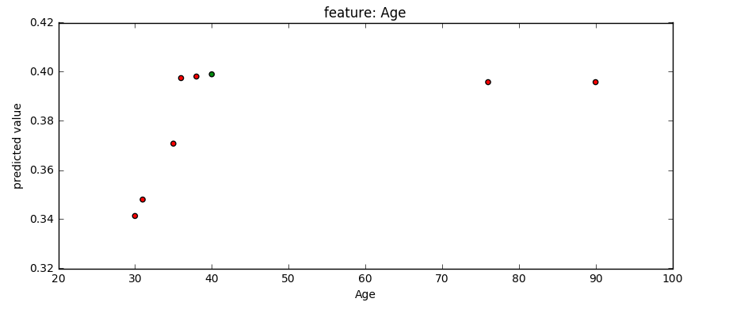
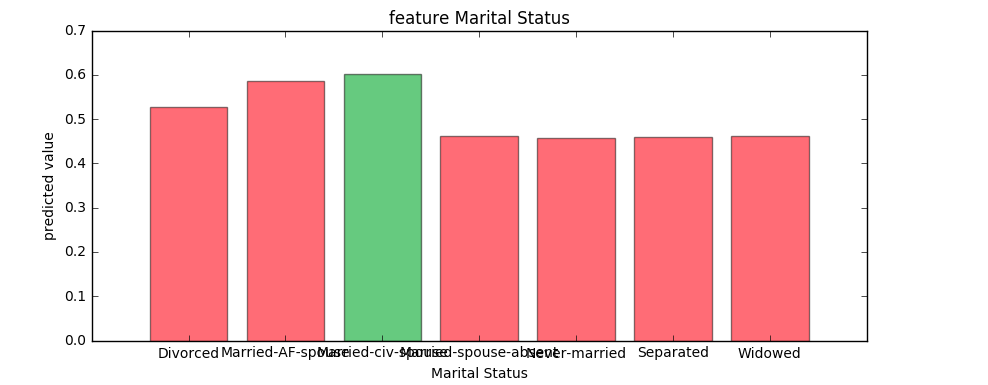

# SiLens: Machine learning model interpretation tool
This tool helps build understanding and trust in Machine Learning models in a generalized way through several approaches. In the initial release we have used two methods to understand couple of things:
- Explanation of predictions made by a model in local regions. We have used LIME as the base for this.
- How changing a predictor value changes the prediction for a particular row in its neighbourhood, keeping all other variables same as in the row of interest.

Both of these approaches are model agnostic i.e. they can work on any machine learning model. Future releases will have more such ways which are beyond the usual error measures and assessment plots. These techniques enhances trust in the model if their results match human domain understanding and expectation.

## Dependencies
- sklearn
- numpy
- lime
- pandas
- scipy

## Installation

The SiLens package is on [PyPI](https://pypi.python.org/pypi/silens). Simply run:

```sh
pip install silens
```

Or clone the repository and run:

```sh
python setup.py install
```

## Installation

## Screenshots
#### Continuous feature case

#### Categorical feature case


## Tutorial
We have provided two ipython notebooks for a sample run for better understanding.
- [LIME for Local Explanation](https://github.com/singularitiai/SiLens/blob/master/doc/notebooks/lime_si_sample_run.ipynb)
- [predictor behavious in a neighbourhood](https://github.com/singularitiai/SiLens/blob/master/doc/notebooks/neighbourhood_effect_sample_run.ipynb)

## Feedback


